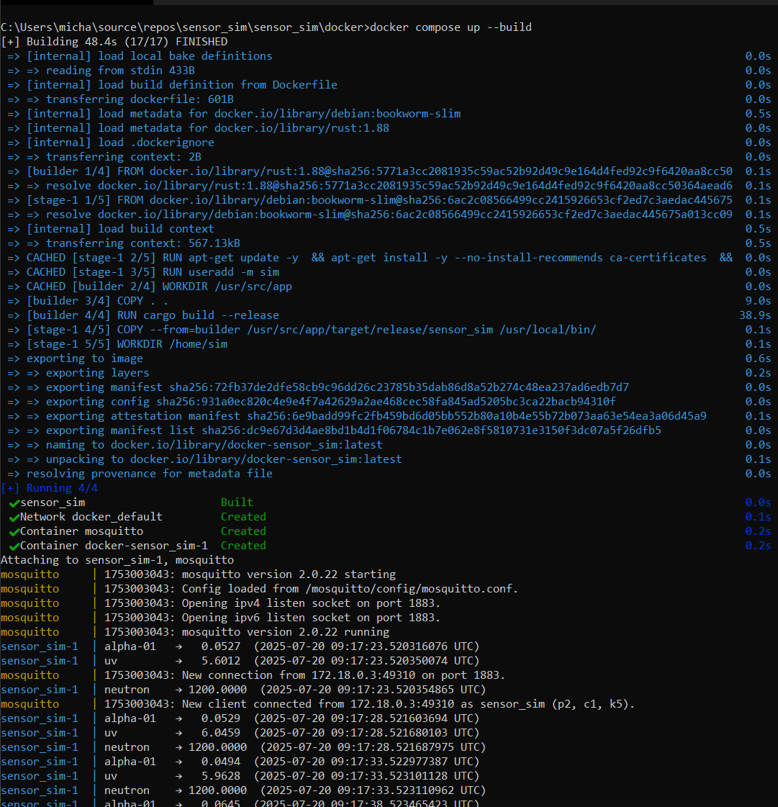

# Rad Sim — Modular Space-Radiation Simulator

Generates realistic synthetic data from three virtual sensors:

* **Gamma**    — dose-rate in mSv h⁻¹  
* **UV**       — UV-Index or µW cm⁻²  
* **Neutron**  — counts s⁻¹  

Every reading is printed to stdout **and** published as a JSON message over MQTT.

---

## Why would I use this?

| Need                                   | How the project helps                         |
| :------------------------------------- | :-------------------------------------------- |
| Integrate dashboards before hardware   | Feeds Grafana / TSDB with realistic traffic   |
| End-to-end pipeline test               | Exercises broker, network and storage         |
| Algorithm prototyping                  | Stable, repeatable data with configurable noise |

---

## Architecture at a glance

```text
src/
├─ bin/                # runnable binaries
│   └─ sensor_sim.rs   # builds sensors → Engine → MQTT
├─ domain/             # pure logic – **no I/O**
│   ├─ engine.rs       # tick() drives all sensors
│   ├─ sensors/        # gamma, uv, neutron + trait Sensor
│   └─ noise/          # gaussian, drift, impulse + trait Noise
├─ infra/              # world-facing I/O
│   ├─ config.rs       # .env → Settings
│   └─ mqtt.rs         # rumqttc helper
└─ model.rs            # RadiationReading DTO
```

---

## Physics models

| Noise model  | Mimics                               |
| ------------ | ------------------------------------ |
| Gaussian     | Electronic / shot noise              |
| Drift        | Ageing, temperature drift            |
| Impulse      | Solar proton burst, HV glitch        |

---

## Quick start

### 1 Prerequisites

* Rust ≥ 1.78  
* Docker (for Mosquitto broker)

### 2 Run broker

```bash
docker run -d --name mosquitto -p 1883:1883 eclipse-mosquitto:2
```

### 3 Configure

```bash
cp .env.example .env   # edit values if desired
```

| Var            | Default                | Meaning                  |
| -------------- | ---------------------- | ------------------------ |
| `MQTT_URL`     | tcp://localhost:1883   | broker endpoint          |
| `INTERVAL_SEC` | 5                      | publish period [s]       |
| `SENSOR__…`    | see file               | gamma baseline / jitter  |

### 4 Run

```bash
cargo run --release
```

Sample:
```
gamma    → 0.053 mSv/h  (2025-07-09T12:00:02Z)
uv       → 6.4          (2025-07-09T12:00:02Z)
neutron  → 1187 cps     (2025-07-09T12:00:02Z)
```

Subscribe:

```bash
docker exec -it mosquitto   mosquitto_sub -t "sensor/#" -v
```

---

## Docker‑compose

```yaml
version: '3.8'
services:
  broker:
    image: eclipse-mosquitto:2
    container_name: mosquitto
    ports: ['1883:1883']
  sim:
    build: .
    environment:
      - MQTT_URL=tcp://broker:1883
      - INTERVAL_SEC=2
    depends_on: [broker]
```

Run:

```bash
docker compose up --build
#or
docker compose -p sim up --build
```

If everything works, you should see something like this:
```
alpha-01   →   0.0527  (2025-07-20 ...)
uv         →   5.6012  (2025-07-20 ...)
neutron    → 1200.0000 (2025-07-20 ...)
```



> *Above: Successful build and startup of the simulation and broker containers. "sensor_sim" emits virtual sensor data and connects to the Mosquitto MQTT broker.*

---

## Extending

* **Add a sensor** — create `domain/sensors/my_sensor.rs`, implement `Sensor`, register in `sensors/mod.rs`, instantiate in `bin/sensor_sim.rs`.
* **Add a noise model** — new file in `domain/noise/`, implement `Noise`, inject into any sensor.
* **Swap transport** — replace `infra/mqtt.rs` with HTTP/gRPC/WebSocket; domain layer stays untouched.

---

## Troubleshooting

| Symptom                              | Fix                                     |
| ------------------------------------ | --------------------------------------- |
| `rand_distr` missing                 | Add `rand_distr = "0.4"` in Cargo.toml  |
| Borrow error in `Engine::tick()`     | Return `(String, f64)` not `&str`       |
| MQTT connection refused              | Broker not running / wrong URL          |

---

## License

© 2025 Astrophysical Hub — All rights reserved.  
The source code is proprietary; redistribution without written permission is prohibited.  
See [LICENSE](./LICENSE) for full terms.
